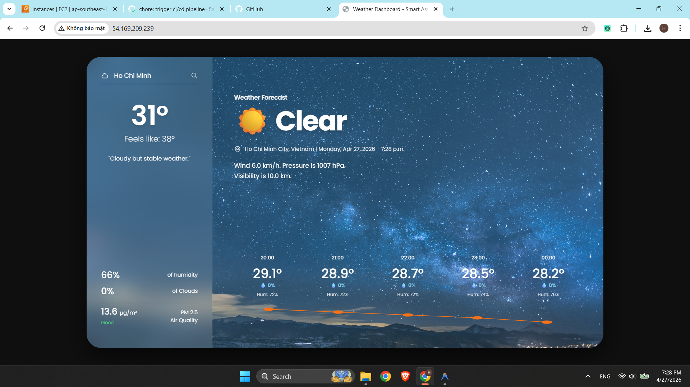
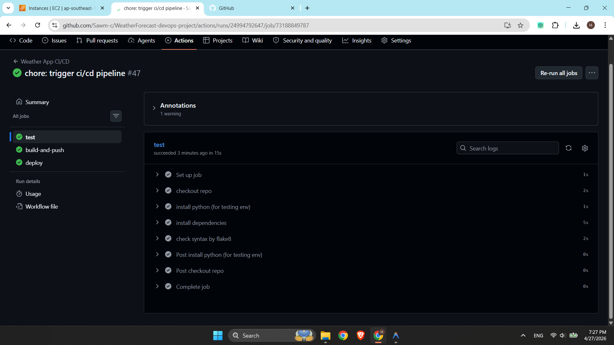
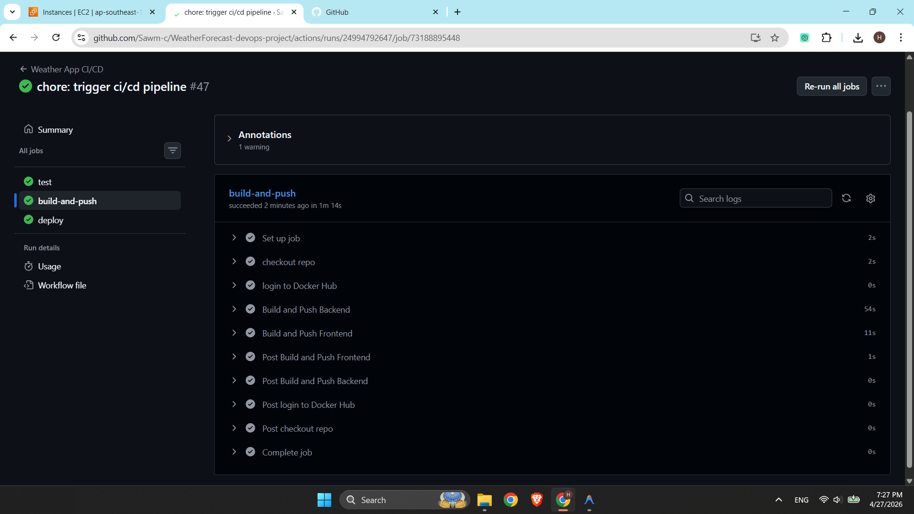
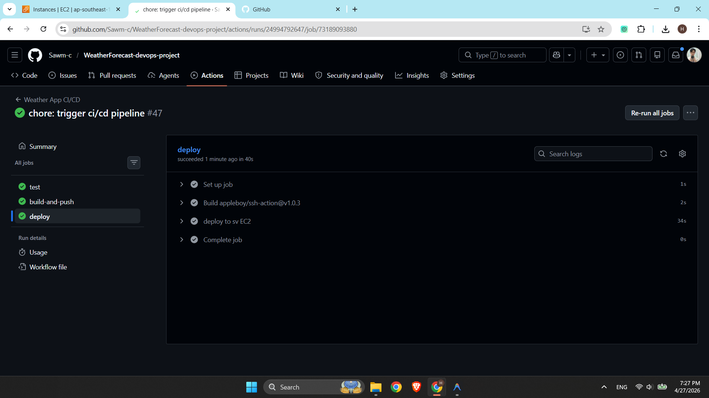
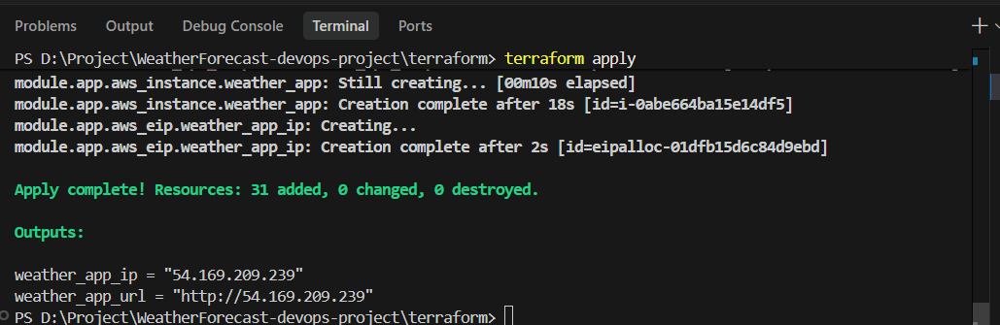
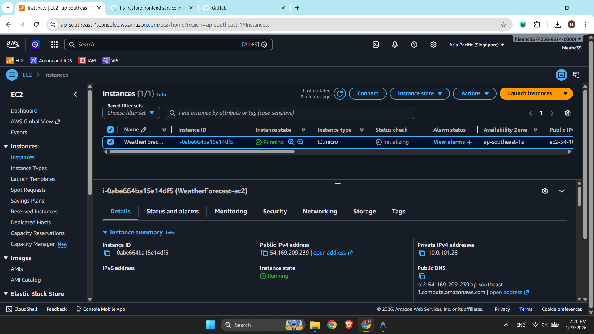

# 🌤️ WeatherForecast DevOps Project

A production-ready weather forecasting web application deployed on **AWS** using a fully automated **DevOps pipeline** — from code commit to live server in under 2 minutes.

> **Stack:** Python · FastAPI · PostgreSQL · Docker · Terraform · GitHub Actions · AWS

---

## 📸 Application Demo



> *Live at `http://54.169.209.239` — deployed automatically via GitHub Actions to AWS EC2*

---

## 📐 Architecture Overview

```
                         ┌──────────────────────────────────────────────────────┐
                         │               AWS Cloud (ap-southeast-1)              │
                         │                                                       │
  Developer              │    ┌────────────────────────────────────────────────┐ │
      │                  │    │              VPC  10.0.0.0/16                  │ │
      │ git push         │    │                                                │ │
      ▼                  │    │   Public Subnet                                │ │
  GitHub Actions ────────┼────┼──▶  ┌──────────────────────────────────────┐  │ │
  (CI/CD Pipeline)       │    │     │  EC2 t3.micro  (Elastic IP)          │  │ │
                         │    │     │                                       │  │ │
  User Browser           │    │     │   ┌──────────┐    ┌──────────────┐   │  │ │
      │                  │    │     │   │  Nginx   │───▶│   FastAPI    │   │  │ │
      │ HTTP :80         │    │     │   │ :80      │    │   :8000      │   │  │ │
      └────────────────────────────▶│   └──────────┘    └──────┬───────┘   │  │ │
                         │    │     │                          │           │  │ │
                         │    │     │                   ┌──────▼───────┐   │  │ │
                         │    │     │                   │  PostgreSQL  │   │  │ │
                         │    │     │                   │     :5432    │   │  │ │
                         │    │     │                   └──────────────┘   │  │ │
                         │    │     └──────────────────────────────────────┘  │ │
                         │    │                                                │ │
                         │    │   ┌──────────┐   ┌────────┐   ┌───────────┐  │ │
                         │    │   │ S3 Bucket│   │  IAM   │   │ Sec Group │  │ │
                         │    │   └──────────┘   └────────┘   └───────────┘  │ │
                         │    └────────────────────────────────────────────────┘ │
                         └──────────────────────────────────────────────────────┘
```

---

## 🔄 CI/CD Pipeline

Every push to `main` triggers a **3-stage automated pipeline** — zero manual steps:

```
  git push origin main
         │
         ▼
  ┌────────────┐     ┌──────────────────────────┐     ┌───────────────────────┐
  │   Stage 1  │     │        Stage 2           │     │       Stage 3         │
  │    TEST    │────▶│     BUILD & PUSH         │────▶│     DEPLOY TO EC2     │
  │            │     │                          │     │                       │
  │  flake8    │     │  docker build backend    │     │  SSH into EC2         │
  │  syntax    │     │  docker build frontend   │     │  docker compose pull  │
  │  check     │     │  push to Docker Hub      │     │  docker compose up -d │
  └────────────┘     └──────────────────────────┘     └───────────────────────┘
```

### Pipeline Results — All Stages Green ✅

**Stage 1 — Code Quality Check (flake8)**


**Stage 2 — Build Docker Images & Push to Docker Hub**


**Stage 3 — Deploy to AWS EC2 via SSH**


---

## ☁️ Infrastructure as Code (Terraform)

Infrastructure is fully defined in **modular Terraform** — reproducible with a single `terraform apply`.

**31 AWS resources provisioned automatically:**

| Module | Resources Created |
|---|---|
| `network` | VPC, Public/Private Subnets, IGW, NAT Gateway, Route Tables, VPC Endpoint |
| `security` | Security Groups (HTTP :80, SSH :22) |
| `iam` | IAM Role, Policy, Instance Profile |
| `storage` | S3 Bucket |
| `app` | EC2 Instance (t3.micro), Elastic IP |

**Terraform Apply Output:**


**AWS EC2 Console — Instance Running:**


---

## 🛠️ Tech Stack

**Application**


**DevOps & Infrastructure**


---

## 🗂️ Project Structure

```
WeatherForecast-devops-project/
├── .github/
│   └── workflows/
│       └── main.yml              # CI/CD Pipeline: Test → Build → Deploy
├── backend/
│   ├── app.py                    # FastAPI application & weather API integration
│   ├── requirements.txt
│   └── Dockerfile
├── frontend/
│   ├── index.html                # Weather Dashboard UI
│   ├── nginx.conf                # Reverse proxy: routes /api/* to FastAPI
│   └── Dockerfile
├── database/
│   └── init.sql                  # PostgreSQL schema initialization
├── terraform/
│   ├── main.tf                   # Root module — orchestrates all child modules
│   ├── variable.tf
│   ├── terraform.tfvars
│   ├── output.tf                 # Outputs: EC2 IP, app URL
│   └── modules/
│       ├── network/              # VPC, Subnets, IGW, NAT GW, VPC Endpoint
│       ├── security/             # Security Groups
│       ├── iam/                  # IAM Role, Policy & Instance Profile
│       ├── storage/              # S3 Bucket
│       └── app/                  # EC2 Instance, Elastic IP
├── docs/                         # Screenshots & documentation assets
└── docker-compose.yml            # Multi-container orchestration
```

---

## ✨ Key Features

- **3-Tier Architecture:** Nginx (FE) → FastAPI (BE) → PostgreSQL (DB), all containerized.
- **Reverse Proxy:** Nginx routes `/api/*` requests to FastAPI internally — backend port not exposed.
- **Weather Caching:** API responses cached in PostgreSQL for 30 minutes to reduce external API calls.
- **Fully Automated CI/CD:** Every `git push` triggers test, build, and deploy — no manual steps.
- **Infrastructure as Code:** All 31 AWS resources defined in modular, reusable Terraform modules.
- **Least-Privilege IAM:** EC2 instance has only the minimum permissions needed to access S3.
- **Private Networking:** PostgreSQL is not exposed to the internet — only reachable within the VPC.

---

## 🚀 How to Deploy

### Prerequisites

- AWS CLI configured (`aws configure`)
- Terraform >= 1.0 installed
- SSH key pair generated

### 1. Provision AWS Infrastructure

```bash
cd terraform
terraform init
terraform plan
terraform apply
# Output: weather_app_ip = "xx.xx.xx.xx"
```

### 2. Configure GitHub Secrets

Add these to **Settings → Secrets and variables → Actions** in your GitHub repo:

| Secret               | Description                            |
| -------------------- | -------------------------------------- |
| `DOCKERHUB_USERNAME` | Docker Hub username                    |
| `DOCKERHUB_TOKEN`    | Docker Hub access token                |
| `SV_IP`              | EC2 Elastic IP (from Terraform output) |
| `SV_USER`            | EC2 username (`ec2-user`)              |
| `WF_PRV_KEY`         | SSH private key content                |
| `DB_USER`            | PostgreSQL username                    |
| `DB_PASSW`           | PostgreSQL password                    |
| `DB_NAME`            | PostgreSQL database name               |
| `API_KEY`            | WeatherAPI.com API key                 |

### 3. Push to Deploy

```bash
git push origin main
# GitHub Actions will automatically:
# ✅ Stage 1: Run flake8 syntax check
# ✅ Stage 2: Build & push Docker images to Docker Hub
# ✅ Stage 3: SSH into EC2 and deploy with Docker Compose
```

---

## 🌐 API Endpoints

| Method | Endpoint                   | Description                      |
| ------ | -------------------------- | -------------------------------- |
| `GET`  | `/`                        | Serve Weather Dashboard UI       |
| `GET`  | `/api/weather?city={city}` | Fetch weather data for any city  |

---

## 💡 What I Learned

- Designing **modular Terraform** infrastructure with reusable, composable child modules.
- Implementing a **3-tier containerized** application with Docker Compose networking.
- Configuring **Nginx as a reverse proxy** to route traffic internally between services.
- Building a complete **CI/CD pipeline** with GitHub Actions for fully automated deployments.
- Applying **AWS security best practices**: Security Groups, IAM least-privilege, private subnets.
- Managing **Terraform state** and resolving dependency/pathing issues between modules.

---

## 📄 License

MIT License — feel free to use this project as a reference.
